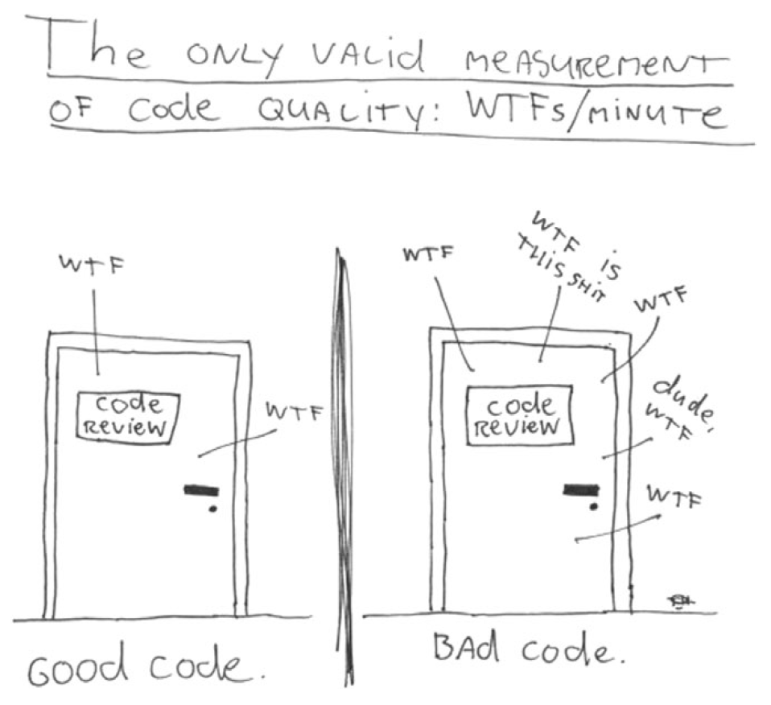

<h1 align="center"> Eren... The Back End Laborer 👾</h1>

 

  <h3>Code Quality Standard That I Accepted</h3>
  </img>

  Visitor count since November 2022
   
  
  <!---->

<h3 align="left">Languages and Tools</h3>

    

    
    
    
    
    
    
    
    
    
    
    
    
    
    
    
    
    
    
    
     
    
    
    
    
    
    
    
    
     
     
    
    
    

